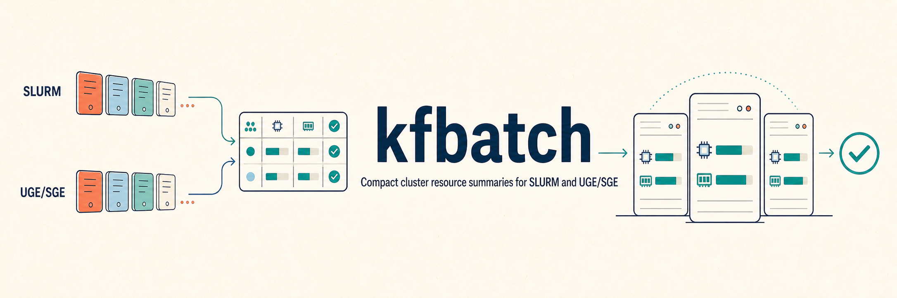

[](https://github.com/kfuku52/kfbatch/actions/workflows/tests.yml)
[](https://github.com/kfuku52/kfbatch/blob/main/.github/workflows/tests.yml)
[](LICENSE)
[](#overview)

## Overview

`kfbatch` prints a compact and deliberately conservative snapshot of batch-cluster
resources:

- Slurm jobs from `squeue`, nodes/partitions/reservations from `scontrol`,
  priority factors from `sprio`, and association FairShare data from `sshare`.
- Altair Grid Engine (AGE), Univa Grid Engine (UGE), and Sun Grid Engine (SGE)
  queue instances from `qstat -F`, all-user jobs from `qstat -u '*'`, and optional
  site quota/launch-slot data from `qfree -c`.

AGE support is tested against the SHIROKANE Supercomputer command formats. SHIROKANE
currently exposes AGE/UGE commands and does not provide Slurm commands on its login
nodes. Optional site commands can be disabled or may degrade independently; the
report labels unavailable or untrusted data instead of treating it as free capacity.

Large scheduler reports are parsed with bounded memory use.

## Installation

Python 3.10 or newer is required.

```bash
python -m pip install "git+https://github.com/kfuku52/kfbatch@main"
kfbatch --version
```

The module entry point is equivalent:

```bash
python -m kfbatch -h
```

## Quick start

Slurm is the default:

```bash
kfbatch
```

AGE/UGE/SGE:

```bash
kfbatch --stat_command "qstat -F"
```

For a wrapper command whose executable name does not reveal the scheduler, specify
it explicitly:

```bash
kfbatch --scheduler uge --stat_command "ssh cluster qstat -F"
```

The AGE defaults use `qstat -u '*'` and the site-specific `qfree -c`. Disable
`qfree` at sites where it is unavailable:

```bash
kfbatch --stat_command "qstat -F" --uge_qfree_command ""
```

## Output

Slurm uses one row per partition and reports task totals as running, queued, and
other terminal/error states (`R/Q/X`):

```text
jobs  self:R/Q/X=0/1/0  all:R/Q/X=4/2/0

fairshare  self=0.500000  account=account_a  assoc_rank=2/3  pending_assoc_rank=2/2

part   nodes  cpu(a/u/t)  ram(a/t)GiB  topCPU               topRAM               launch
epyc   2/0/2  48/8/64     144/192      compute02 32c/64GiB  compute01 16c/80GiB  <=32c/64GiB
short  0/1/1  0/0/16      ?/32         -                    -                    n/a

legend: nodes=working/abnormal/total, cpu=available/used/total, ram=available/total
        launch=res<=CPU/RAM-only ceiling (reservation-adjusted, not a start guarantee)
```

`assoc_rank` ranks user/account associations, not unique people. If the current
user has multiple associations and no queued job identifies one unambiguously,
the output explicitly says that the highest-FairShare association was selected.

AGE/UGE/SGE uses the same compact layout and adds `qfree` quota data when available:

```text
jobs  self:R/Q/F=0/0/0  all:R/Q/F=4/248/5

queue    nodes  cpu(a/u/t)  ram(a/t)GiB  topCPU               topRAM  quota(s/g/l)  launch2G
mjobs.q  1/0/1  12/4/16     384/512      compute01 12c/24GiB  same    4/8/128       24(+16s)
intr.q   1/0/1  7/1/8       30/32        compute02 7c/20GiB   same    0/0/24        7

legend: nodes=working/abnormal/total, cpu=available/used/total, ram=available/total
        ram uses qfree request headroom/capacity; topRAM is queue-instance request headroom
        quota=self/group/limit slots (inf=unlimited), launch2G=immediate slots (+standby)
```

`?` means that the scheduler did not provide a trustworthy value. Scheduler memory
suffixes are interpreted as binary units and displayed in GiB (`1G = 1024M`).
Available memory is floored so the display never rounds launch capacity upward.

## Useful options

```bash
# Merge three Grid Engine snapshots using the minimum trustworthy availability.
kfbatch --stat_command "qstat -F" --niter 3

# Show two best nodes for CPU and RAM; include ties at the second tier.
kfbatch --ntop 2 --all_tiers yes

# Limit each scheduler command to 15 seconds. Zero disables timeouts.
kfbatch --command_timeout 15

# Keep the compact Slurm table but omit priority-derived launch details.
kfbatch --show_launch_heuristic no

# Omit the Slurm association FairShare line.
kfbatch --show_fairshare_rank no
```

Run entirely from the repository's synthetic fixtures:

```bash
kfbatch \
  --example_file tests/fixtures/slurm/squeue_full.txt \
  --stat_command squeue \
  --slurm_node_example_file tests/fixtures/slurm/nodes.txt \
  --slurm_partition_example_file tests/fixtures/slurm/partitions.txt \
  --slurm_reservation_example_file tests/fixtures/slurm/reservations.txt \
  --slurm_prio_example_file tests/fixtures/slurm/sprio.txt \
  --show_fairshare_rank no
```

## TSV output

Node and job tables have separate output paths:

```bash
kfbatch --out_nodes nodes.tsv --out_jobs jobs.tsv
```

Writes are atomic and both paths must resolve to different files. `--out` remains a
legacy alias of `--out_nodes`. If Slurm node discovery fails, the job TSV can still
be written, the node TSV is not created, and the command returns a non-zero status.

## Accuracy and failure behavior

- AGE states such as `Rq` and `hRq` are queued, while `Eqw` is failed.
- Text `qstat -u '*'` preserves pending array ranges. If a custom JSON command omits
  array metadata, affected task counts are labeled as estimated.
- With `--niter`, a queue instance missing from any snapshot is unavailable. Any
  abnormal state or unknown memory seen during the sampling window is retained.
  A completely unparseable later snapshot is an error.
- The AGE queue table is the union of `qstat` and `qfree` queues, so quota-only and
  resource-only queues remain visible.
- Unknown Slurm partition metadata is abnormal, never implicitly `UP`.
- Active Slurm reservations inaccessible to the current user are subtracted across
  every partition alias of the physical node. Access checks combine configured
  user, group, account, QOS, and partition restrictions. Unresolved or unavailable
  reservation metadata suppresses resource ceilings.
- Slurm `launch` is only a single-node CPU/RAM ceiling. It is not an immediate-start
  prediction and does not model every scheduling constraint.
- Required job/resource command failures return non-zero. Optional command failures
  print a `note: degraded ...` explanation.
- Scheduler output is decoded defensively, so invalid UTF-8 in a job name does not
  crash the report.

## Development

All checked-in scheduler samples are small synthetic fixtures. Do not add live
scheduler captures.

```bash
python -m pip install -e ".[dev]"
python -m ruff check .
python -m ruff format --check .
python -m pytest --cov=kfbatch --cov-branch
python -m build
```

Performance-sensitive changes can be checked with:

```bash
python -m benchmarks.benchmark_parsers
```

See [CONTRIBUTING.md](CONTRIBUTING.md), [SECURITY.md](SECURITY.md), and
[CHANGELOG.md](CHANGELOG.md).

## License

This program is MIT-licensed. See [LICENSE](LICENSE) for details.
